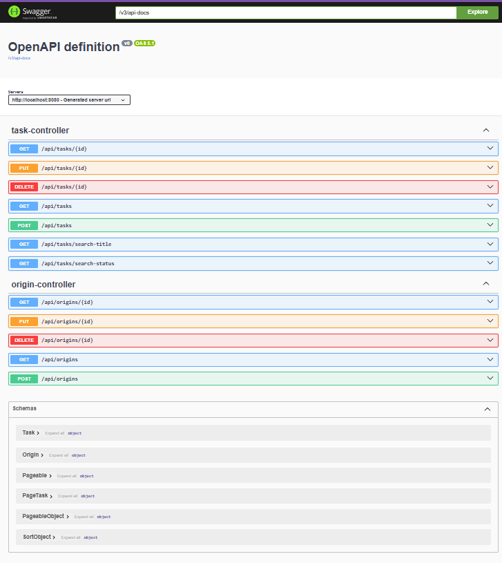

# DTS Developer Technical Test
This is a java spring boot project bootstraped from [Spring Initializer](https://start.spring.io)

## Description
A simple API enabling HMCTS's caseworkers keep track of their tasks from a web application.

## Server set up

* Open your desired terminal application.

* Clone the project from this [GitHub repository](https://github.com/daveace007/back-end-hmcts-dts-developer-challenge.git) by issuing:

  ```$ git clone https://github.com/daveace007/back-end-hmcts-dts-developer-challenge.git```
* Change directory by issuing:

  ```$ cd hmcts-dts-developer-challenge/```
* Run the ```start.sh``` script to initiate the build process then test and launch the server from terminal by issuing:
  ```$ ./start.sh```

You should see the server running at port 8080 after testing and completing the build process.

* Next, you can manually verify the API by testing it on PostMan, making a GET request to the server via *http://localhost:8080/api/task*

* Or you can use __curl__ by issuing:

  ``` $ curl -X GET http://localhost:8080/api/task ```

### API Documentation
After running the script above, you can access the API documentation from the browser.

Simply:
* Open your web browser

* Type *http://localhost:8080/swagger-ui/index.html* on the browser address bar and hit enter.

You should see the screen below in your current browser tab



Explore the API functionalities using the Swagger UI above.

*Happy review!*
